# QUEN

**Verified execution for tokenized markets on Robinhood Chain.**

QUEN is a non-custodial execution interface for tokenized markets, USDG settlement, and qualified liquidity routes on Robinhood Chain. It reads current on-chain evidence, evaluates whether a requested route is usable, simulates the action, and leaves every transaction signature under the control of the connected wallet.

The central design principle is simple:

> An asset being visible does not mean it is tradable, a route being configured does not mean it is available, and a submitted transaction does not mean the intended result occurred.

QUEN keeps those states separate. Every actionable surface is expected to prove the conditions required for the specific operation before asking the wallet to sign.

---

## Table of contents

1. [What QUEN does](#what-quen-does)
2. [Current product surfaces](#current-product-surfaces)
3. [System overview](#system-overview)
4. [Core execution principles](#core-execution-principles)
5. [RWA Gateway](#rwa-gateway)
6. [Settlement Rails](#settlement-rails)
7. [Unified Liquidity](#unified-liquidity)
8. [Wallet lifecycle](#wallet-lifecycle)
9. [Data and price model](#data-and-price-model)
10. [Route qualification](#route-qualification)
11. [Network configuration](#network-configuration)
12. [Contract references](#contract-references)
13. [Application routes](#application-routes)
14. [Technology stack](#technology-stack)
15. [Repository structure](#repository-structure)
16. [Local development](#local-development)
17. [RPC proxy behavior](#rpc-proxy-behavior)
18. [Testing and validation](#testing-and-validation)
19. [Security model](#security-model)
20. [Failure behavior](#failure-behavior)
21. [Known boundaries](#known-boundaries)
22. [Troubleshooting](#troubleshooting)
23. [Contributing](#contributing)
24. [Risk disclosures](#risk-disclosures)
25. [Official links](#official-links)

---

## What QUEN does

QUEN connects three related activities through one verification model:

- trading canonical Robinhood Tokens against canonical USDG;
- sending USDG or creating a USDG payment request;
- reviewing and using liquidity routes only when their live requirements pass.

The interface is non-custodial. It does not hold private keys, sign on behalf of a user, or move funds without a wallet transaction. Public network state can be read before connection, but any state-changing operation must be reviewed and signed by the user.

QUEN is not designed as a generic promise that every configured product works at all times. Markets, pools, token controls, wallet balances, allowances, quotes, and RPC availability can change. The application therefore distinguishes discovery from qualification and qualification from execution.

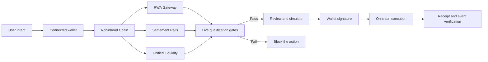

---

## Current product surfaces

| Surface | Purpose | Current execution boundary |
|---|---|---|
| RWA Gateway | Buy and sell supported tokenized-market assets against USDG | A market is actionable only after its identity, controls, venue, pool, quote, and wallet checks pass |
| Settlement Rails | Send canonical USDG and create EIP-681 payment requests | Settlement is currently single-chain on Robinhood Chain |
| Unified Liquidity | Inspect configured liquidity routes and interact only when qualified | Blocked or unavailable routes remain non-actionable |
| Documentation | Explain setup, execution semantics, references, and risks | Documentation describes verified current behavior rather than assumed future capability |

### Product relationship

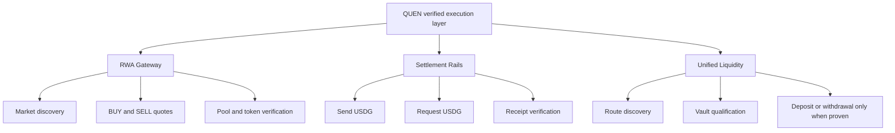

---

## System overview

The browser application communicates with Robinhood Chain through read-only RPC operations and wallet-provided transaction methods. Contract reads and simulations establish whether an action can be presented. The connected wallet remains the final authority for signing.

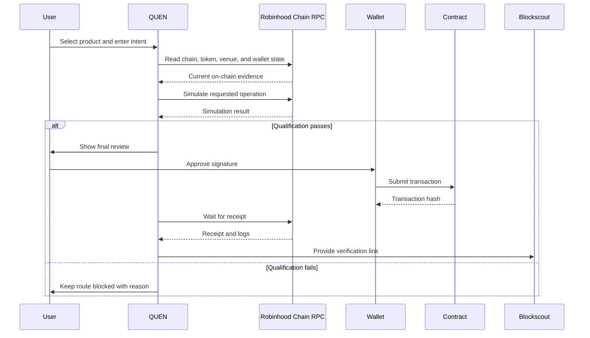

### Trust boundaries

QUEN treats each external component as a separate trust boundary:

1. **The wallet** controls the account and signatures.
2. **Robinhood Chain RPC** reports network state and accepts read requests.
3. **Token contracts** define balances, approvals, transfer controls, and authority behavior.
4. **DEX contracts** determine pools, executable quotes, and swap behavior.
5. **Vault contracts** determine deposit and withdrawal semantics.
6. **Reference feeds** provide market context where mappings exist.
7. **Blockscout** provides an independent transaction and event inspection surface.

No single UI status is treated as a permanent guarantee about any of these components.

---

## Core execution principles

### 1. Evidence before action

QUEN checks current chain evidence before exposing a transaction path. Configuration alone is not sufficient proof.

### 2. Freshness before signature

Conditions may change after the user first opens a page. Important checks are repeated close to wallet submission.

### 3. Simulation before submission

Where supported, the exact transaction is simulated before the wallet is asked to sign. A failed simulation blocks the action.

### 4. Wallet control

QUEN never receives a private key. The wallet displays and signs each transaction.

### 5. Receipt verification

A transaction hash is not the final success condition. QUEN waits for the receipt and checks the expected outcome or event.

### 6. Explicit unavailability

Missing data is not replaced with invented APY, TVL, quotes, or route status. If live evidence cannot be obtained, the affected operation remains unavailable.

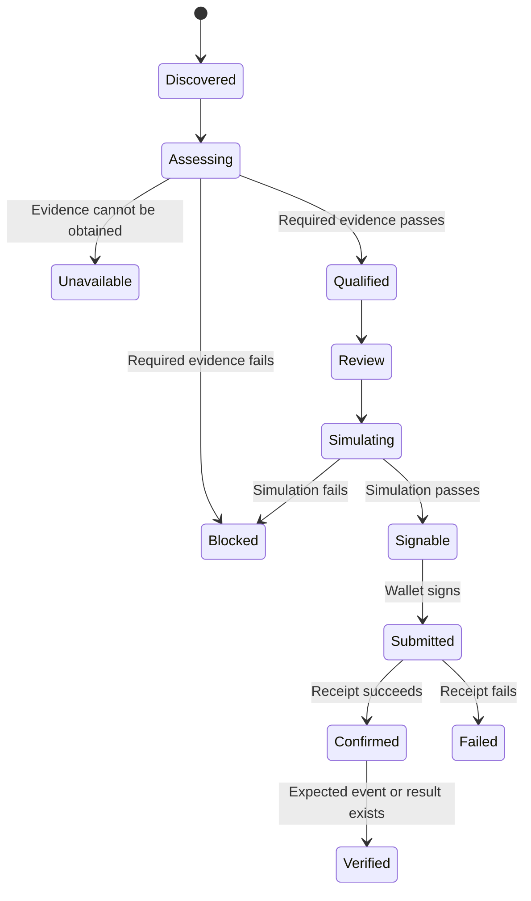

---

## RWA Gateway

RWA Gateway is the tokenized-market execution surface. It supports trade discovery and execution against canonical USDG only when the selected market passes the required checks.

### BUY flow

In a BUY operation, USDG is the input asset and the selected Robinhood Token is the output asset.

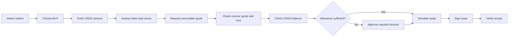

### SELL flow

In a SELL operation, the selected Robinhood Token is the input asset and USDG is the output asset.

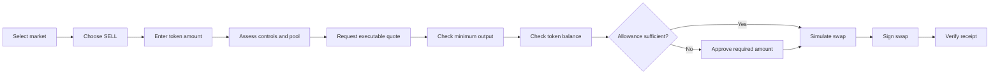

### Market status meanings

| Status | Meaning |
|---|---|
| Registry | The asset is known to the application, but that alone does not prove tradability |
| Assessing | Current chain, token, venue, and pool evidence is being collected |
| Qualified | The market has passed the required point-in-time checks |
| Tradable | A valid quote and wallet state make the requested trade actionable |
| Blocked | One or more required checks failed |
| Unavailable | Required live evidence could not be obtained |

### What can block a trade

- unverified token identity, metadata, or deployed bytecode;
- paused transfer or oracle controls;
- authority or implementation evidence that cannot be qualified;
- missing or unhealthy USDG pool;
- incorrect execution venue;
- unsupported fee tier;
- failing spot or TWAP checks;
- missing or stale quote;
- excessive round-trip loss;
- insufficient token balance;
- insufficient USDG balance;
- insufficient native ETH for gas;
- missing allowance;
- chain or connected-account mismatch;
- failed transaction simulation.

### Executable price versus reference price

The executable trade price comes from the qualified DEX route and quoter. Where a Chainlink mapping exists, it is used as reference context. A reference feed is not the DEX execution price and does not guarantee that a pool can execute at the same value.

---

## Settlement Rails

Settlement Rails supports canonical USDG transfers and EIP-681 payment requests on Robinhood Chain.

### Send USDG

The send flow validates the recipient, amount, connected account, chain, balance, token state, gas conditions, and simulation before signing.

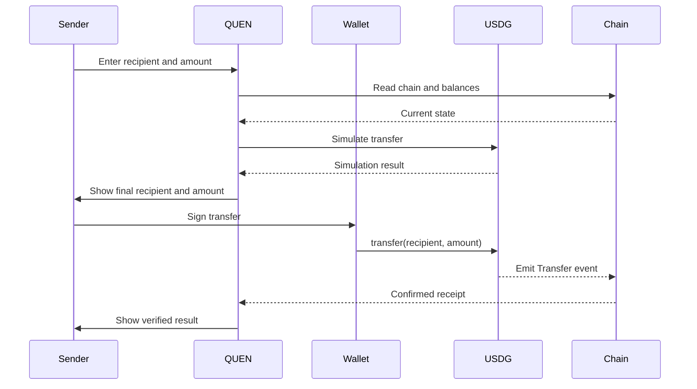

### Request USDG

A payment request creates an EIP-681 URI containing:

- the canonical USDG contract;
- Robinhood Chain ID;
- the connected wallet as recipient;
- the requested amount in USDG base units.

The recipient shown in the request flow is the connected wallet because that wallet will receive the payment. The URI itself does not move funds. A payer must open it in a compatible wallet, review the transaction, and sign.

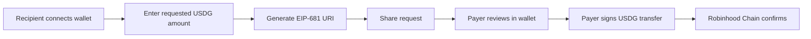

### Settlement boundary

Settlement Rails is currently single-chain. A payment request must not be interpreted as a bridge or as proof of cross-chain USDG support.

---

## Unified Liquidity

Unified Liquidity is the route qualification and capital-action surface. It is designed to present configured liquidity opportunities without assuming they are usable.

A route may be:

- **Live** — required data is available and the surface is operational;
- **Qualified** — the specific route passes current identity and action checks;
- **Blocked** — a hard requirement failed;
- **Unavailable** — current live evidence is incomplete or inaccessible.

### Route qualification model

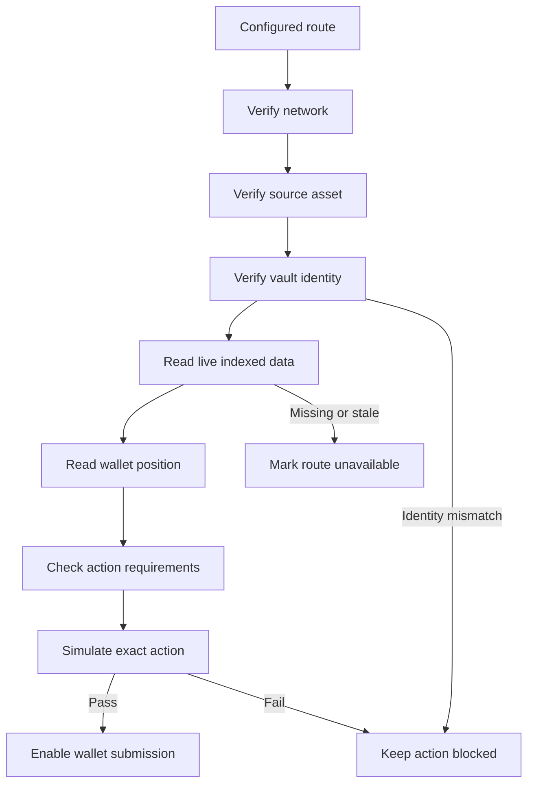

### Deposit and withdrawal semantics

Approval, deposit, and withdrawal are treated as separate state transitions:

1. verify the selected account and network;
2. read fresh token balance and allowance;
3. verify the configured vault identity;
4. establish whether the requested action is actually supported;
5. simulate the exact action;
6. request approval only if required;
7. submit the deposit or withdrawal only after revalidation;
8. wait for and inspect the transaction receipt;
9. refresh the resulting wallet position.

QUEN does not infer availability from a marketing label, historical data, or a displayed APY. A route that cannot prove the action remains unavailable.

---

## Wallet lifecycle

The wallet remains in control from connection through confirmation.

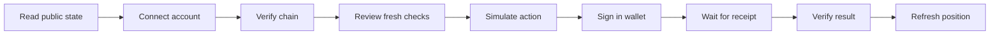

### Connection responsibilities

The connected wallet supplies:

- the active account;
- the active network;
- transaction signing;
- approval signing where necessary;
- transaction submission.

QUEN supplies:

- readable transaction context;
- point-in-time qualification;
- balance and allowance checks;
- simulation requests;
- minimum-output and deadline constraints where relevant;
- receipt and event verification links.

### Allowances

Token allowance is requested only when the contract flow requires it. Users should still inspect approval details in the wallet. An allowance transaction and the final action transaction are separate operations.

---

## Data and price model

| Source | Used for | Boundary |
|---|---|---|
| Robinhood Chain RPC | Contract reads, balances, blocks, storage, simulation, gas estimates, and receipts | RPC state may be delayed or temporarily unavailable |
| DEX factory and pools | Pool discovery and execution venue evidence | A deployed pool does not automatically mean sufficient or healthy liquidity |
| DEX quoter | Executable route output | Quotes are short-lived and may change before inclusion |
| Spot and TWAP observations | Price-behavior checks | Historical observations do not guarantee future execution |
| Chainlink mappings | Reference prices for mapped tokenized-market assets | Not an execution quote and not available for every asset |
| Indexed vault data | Route and vault context | Must correspond to the configured chain and vault |
| Blockscout | Independent receipt, log, contract, and transaction inspection | The transaction hash and receipt are the source of verification |

### Price relationship

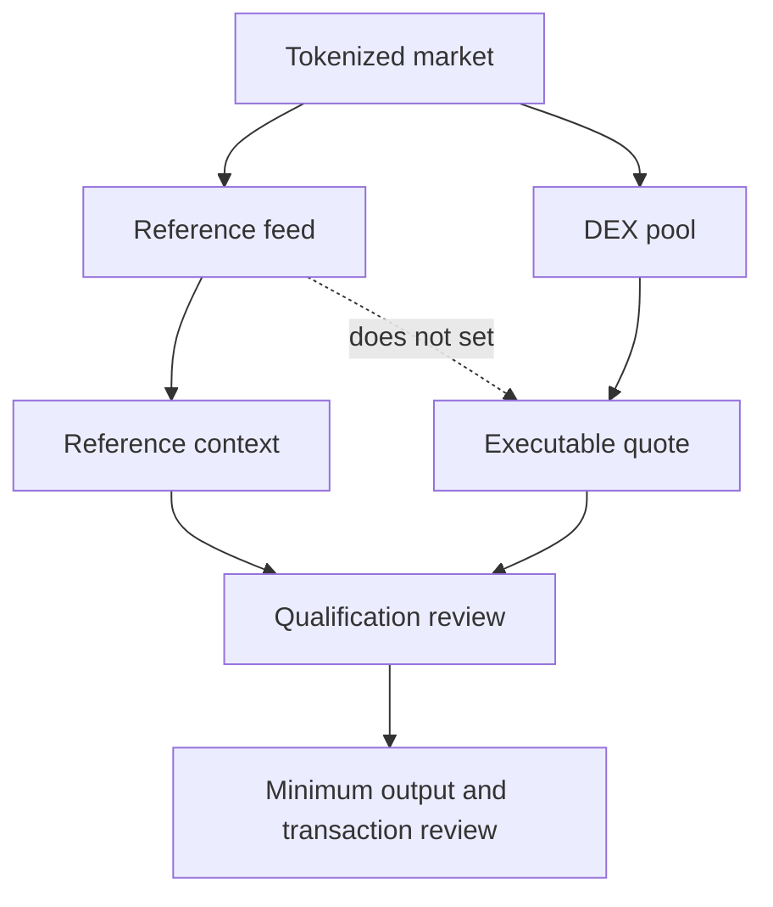

---

## Route qualification

Qualification is specific to the requested action. Passing an identity check does not automatically pass liquidity, quote, balance, allowance, or simulation checks.

### Qualification layers

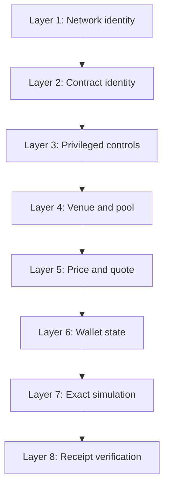

| Layer | Example checks |
|---|---|
| Network identity | Chain ID, RPC response, latest block |
| Contract identity | Address, bytecode, metadata, implementation evidence |
| Privileged controls | Pause state, transfer controls, oracle controls, authority storage |
| Venue and pool | Factory, router, quoter, token pair, fee tier, pool state |
| Price and quote | Quote freshness, spot/TWAP behavior, reverse quote, round-trip loss |
| Wallet state | Account, balance, allowance, native gas balance |
| Exact simulation | Contract call simulation using the intended parameters |
| Receipt verification | Receipt status and expected event or state transition |

### Point-in-time semantics

A qualified result means the required checks passed for the observed state. It does not guarantee:

- future liquidity;
- future quote availability;
- future token-controller behavior;
- issuer performance;
- oracle continuity;
- RPC uptime;
- transaction inclusion;
- profitable execution;
- redemption value.

---

## Network configuration

| Field | Value |
|---|---|
| Network | Robinhood Chain |
| Chain ID | `4663` |
| Chain ID hexadecimal | `0x1237` |
| Native gas token | `ETH` |
| Public RPC | `https://rpc.mainnet.chain.robinhood.com` |
| Explorer | `https://robinhoodchain.blockscout.com` |

### Wallet network object

```ts
const robinhoodChain = {
  id: 4663,
  name: 'Robinhood Chain',
  nativeCurrency: {
    name: 'Ether',
    symbol: 'ETH',
    decimals: 18,
  },
  rpcUrls: {
    default: {
      http: ['https://rpc.mainnet.chain.robinhood.com'],
    },
  },
  blockExplorers: {
    default: {
      name: 'Blockscout',
      url: 'https://robinhoodchain.blockscout.com',
    },
  },
};
```

---

## Contract references

The following contracts are runtime references used by the current application on Robinhood Chain.

| Contract | Address | Role |
|---|---|---|
| Canonical USDG | `0x5fc5360D0400a0Fd4f2af552ADD042D716F1d168` | Settlement and quote asset; 6 decimals |
| RWA quoter | `0x33e885ed0ec9bf04ecfb19341582aadcb4c8a9e7` | Executable route quotation |
| RWA router | `0xcaf681a66d020601342297493863e78c959e5cb2` | Swap execution |
| RWA factory | `0x1f7d7550b1b028f7571e69a784071f0205fd2efa` | Pool discovery |
| Configured vault | `0xBeEff033F34C046626B8D0A041844C5d1A5409dd` | Unified Liquidity route reference |
| WETH | `0x0Bd7D308f8E1639FAb988df18A8011f41EAcAD73` | Wrapped native asset reference |

Always verify addresses independently before signing. A reference listed in this repository is not, by itself, a guarantee that the corresponding route is currently available.

---

## Application routes

| Path | Surface |
|---|---|
| `/` | QUEN landing page |
| `/app` | Unified Liquidity |
| `/app/rwa` | RWA Gateway |
| `/app/settlement` | Settlement Rails |
| `/docs` | Full product documentation |

The routes are loaded independently so product code does not need to be included in the initial landing-page bundle.

---

## Technology stack

- React 19
- TypeScript
- Vite
- Bun
- viem
- Tailwind CSS
- GSAP
- Motion
- Lucide icons
- happy-dom for browser-oriented tests

### Runtime structure

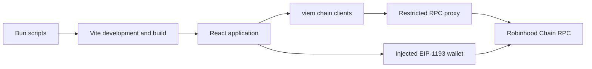

---

## Repository structure

```text
.
├── src/
│   ├── app/
│   │   ├── LiquidityApp.tsx
│   │   ├── RwaGateway.tsx
│   │   ├── SettlementApp.tsx
│   │   ├── VaultActions.tsx
│   │   ├── rwaEvidence.ts
│   │   ├── settlementHelpers.ts
│   │   └── *.test.ts
│   ├── components/
│   │   └── landing-page sections
│   ├── docs/
│   │   ├── DocsPage.tsx
│   │   └── docsSearch.ts
│   ├── App.tsx
│   ├── animations.ts
│   ├── index.css
│   └── main.tsx
├── index.html
├── package.json
├── tsconfig.json
└── vite.config.ts
```

### Responsibility map

| Area | Responsibility |
|---|---|
| `src/app/RwaGateway.tsx` | Market assessment, quotes, BUY/SELL review, simulation, and transaction lifecycle |
| `src/app/rwaEvidence.ts` | Known RWA evidence and mapping definitions |
| `src/app/SettlementApp.tsx` | Send and request user experience |
| `src/app/settlementHelpers.ts` | Settlement validation and EIP-681 request construction |
| `src/app/LiquidityApp.tsx` | Route discovery, live qualification, and unified product state |
| `src/app/VaultActions.tsx` | Approval, deposit, withdrawal, and position actions |
| `src/docs` | Searchable product documentation |
| `src/components` | Public landing-page sections and navigation |
| `vite.config.ts` | Build configuration, development server, and restricted RPC proxy |

---

## Local development

### Prerequisites

- Bun installed locally;
- an EIP-1193 compatible browser wallet for transaction testing;
- Robinhood Chain ETH for gas when testing state-changing actions;
- the intended test assets on Robinhood Chain.

### Install

```bash
bun install
```

### Start the development server

```bash
bun run dev
```

The development server uses port `5000`.

### Type-check

```bash
bun run lint
```

The `lint` command currently runs TypeScript without emitting build files.

### Test

```bash
bun test
```

### Production build

```bash
bun run build
```

### Preview the production build

```bash
bun run preview
```

### Clean generated output

```bash
bun run clean
```

---

## RPC proxy behavior

The development and preview server expose a restricted `/robinhood-rpc` endpoint for approved read operations.

### Allowed methods

- `eth_chainId`
- `eth_blockNumber`
- `eth_getBlockByNumber`
- `eth_getCode`
- `eth_call`
- `eth_getBalance`
- `eth_getStorageAt`
- `eth_gasPrice`
- `eth_estimateGas`
- `eth_getTransactionByHash`
- `eth_getTransactionReceipt`

### Request limits

- only `POST` requests are accepted;
- request bodies are capped at 256 KB;
- a JSON-RPC batch can contain at most 50 calls;
- requests are rate-limited per remote address;
- unsupported methods are rejected;
- upstream requests use a bounded timeout;
- the public Robinhood Chain RPC can serve as fallback.

### Optional upstream

An alternative Robinhood Chain RPC can be supplied through:

```text
QUICKNODE_ROBINHOOD_RPC_URL
```

Do not commit private RPC URLs or credentials to the repository. Configure them in the environment where the application runs.

### Proxy flow

```mermaid
flowchart TD
    A[Browser read request] --> B[/robinhood-rpc]
    B --> C{POST method?}
    C -->|No| R1[Reject 405]
    C -->|Yes| D{Within rate and size limits?}
    D -->|No| R2[Reject 413 or 429]
    D -->|Yes| E{Allowed JSON-RPC method?}
    E -->|No| R3[Reject 400]
    E -->|Yes| F[Try configured upstream]
    F -->|Unavailable| G[Try public RPC]
    F -->|Success| H[Return upstream response]
    G -->|Success| H
    G -->|Unavailable| R4[Return 503]
```

---

## Testing and validation

The repository includes automated coverage for important qualification and settlement helper behavior.

Before opening a pull request, run:

```bash
bun run lint
bun test
bun run build
```

Recommended validation sequence:

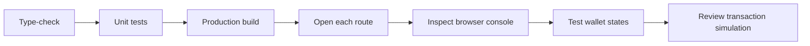

### Manual states worth checking

- wallet disconnected;
- wallet connected on the wrong chain;
- correct chain with no ETH for gas;
- correct chain with insufficient token balance;
- allowance required;
- quote unavailable;
- quote expired;
- route blocked;
- RPC temporarily unavailable;
- simulation failure;
- wallet rejection;
- submitted transaction;
- reverted receipt;
- successful receipt with expected event.

---

## Security model

QUEN reduces avoidable execution risk through explicit checks, but it cannot remove smart-contract, market, issuer, administrator, oracle, liquidity, wallet, or network risk.

### Security controls in the interface

- exact chain verification;
- canonical contract-address checks;
- deployed bytecode checks;
- token metadata checks;
- transfer and oracle control inspection;
- implementation and authority evidence;
- factory, router, quoter, and pool checks;
- quote freshness;
- spot and TWAP observations;
- reverse-quote and round-trip-loss checks;
- account balance and allowance checks;
- native gas balance checks;
- exact transaction simulation;
- minimum-output and deadline protection;
- receipt and expected-event verification;
- explicit unavailable states when evidence is missing.

### Security boundaries

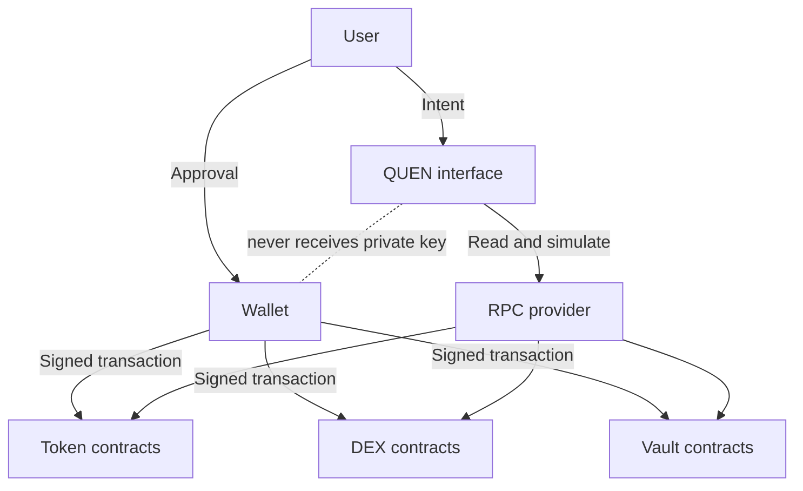

### Reporting a vulnerability

Do not publish an unpatched vulnerability, exploit path, private key, or sensitive RPC credential in a public issue. Use a private communication channel with the project maintainers and include:

- affected route and component;
- reproduction conditions;
- expected versus observed behavior;
- transaction hash if it is safe to share;
- impact assessment;
- suggested mitigation if known.

---

## Failure behavior

The application is designed to fail explicitly rather than silently substitute stale or fictional values.

| Condition | Expected behavior |
|---|---|
| RPC unavailable | Mark affected reads or route unavailable |
| Quote unavailable | Keep trade disabled |
| Quote stale | Require a fresh quote |
| Token control fails | Block the market |
| Pool missing | Block executable trading |
| Wrong chain | Request a switch to Robinhood Chain |
| Insufficient balance | Disable submission and explain the requirement |
| Insufficient allowance | Present the required approval step |
| Simulation fails | Do not request the final action signature |
| Wallet rejects | Keep funds unmoved and return to review |
| Receipt reverts | Report the transaction as failed |
| Expected event missing | Do not label the operation verified |
| Vault data unavailable | Do not display cached APY or TVL as live |

---

## Known boundaries

Current behavior should not be interpreted beyond these limits:

1. RWA registry inclusion is not a promise that a market is tradable.
2. Chainlink mappings are reference prices, not executable DEX quotes.
3. Not every asset has a reference-feed mapping.
4. Settlement supports USDG on Robinhood Chain and does not currently bridge USDG.
5. EIP-681 payment requests are instructions for a compatible wallet, not completed payments.
6. Liquidity routes are unavailable unless current evidence qualifies them.
7. A displayed status is a point-in-time result.
8. No route guarantees yield, APY, liquidity, safety, redemption, or future availability.
9. Tokenized equities represent economic exposure and are not direct ownership of underlying shares.
10. The connected wallet and user remain responsible for reviewing every signature.

---

## Troubleshooting

### The wallet is on the wrong network

Switch to Robinhood Chain:

- chain ID: `4663`;
- hexadecimal chain ID: `0x1237`;
- native gas asset: `ETH`.

Reconnect or refresh the product surface after switching.

### A market shows Registry

Registry means the asset is known. It does not mean all token, control, venue, pool, and quote checks have passed.

### A market or route is Blocked

At least one required qualification check failed. Review the displayed reason. Do not treat Blocked as a temporary loading label.

### A route is Unavailable

The application could not establish the live evidence needed to present the operation safely. This can occur because of RPC failure, missing indexed data, unsupported contract behavior, or an unavailable execution path.

### The quote expired

Request a new quote. Quotes are intentionally short-lived because pool conditions can change.

### Approval succeeded but the action did not run

Approval only changes token allowance. Return to the action review, refresh balances and allowance, obtain a fresh quote if needed, and simulate again before signing the final transaction.

### A transaction was submitted but is not confirmed

Open the transaction hash in Blockscout and inspect its current status. Do not submit a duplicate transaction until the wallet nonce and original transaction state are understood.

### The transaction is confirmed but QUEN does not show success

Inspect the receipt and logs. QUEN expects the correct event or resulting state, not only a successful-looking hash.

### The payment request contains the connected address

That address is the payment recipient. In Receive / Request mode, the connected wallet is intentionally encoded as the destination so a payer sends USDG to that wallet.

---

## Contributing

Contributions should preserve the verified-execution model.

### Pull request expectations

1. Keep user-facing claims narrower than or equal to proven runtime behavior.
2. Do not enable a route solely because an address is configured.
3. Do not replace unavailable live data with invented values.
4. Revalidate sensitive state immediately before wallet submission.
5. Simulate state-changing calls where the chain and contract support it.
6. Verify receipts and expected results after submission.
7. Add or update tests when changing validation, amount handling, route qualification, or transaction semantics.
8. Keep wallet and chain errors readable; do not expose unnecessary raw payloads.
9. Run type-checking, tests, and the production build.
10. Document new routes and their exact limitations.

### Suggested commit scope

Keep changes focused around one behavior:

- `rwa: ...`
- `settlement: ...`
- `liquidity: ...`
- `docs: ...`
- `ui: ...`
- `test: ...`
- `security: ...`

### Review checklist

```text
[ ] The route is backed by current on-chain evidence.
[ ] Address and chain assumptions are explicit.
[ ] Wrong-network behavior is handled.
[ ] Balance and allowance behavior is handled.
[ ] Quote freshness is enforced where applicable.
[ ] The exact action is simulated.
[ ] Wallet rejection is handled.
[ ] Receipt failure is handled.
[ ] Expected events or state changes are verified.
[ ] User-facing claims match current capability.
[ ] Type-check, tests, and production build pass.
```

---

## Risk disclosures

Tokenized equities provide economic exposure and are not direct ownership of underlying shares. DEX execution may differ from reference prices and may include price impact, pool fees, network fees, and slippage.

Smart-contract, liquidity, oracle, issuer, administrator, wallet, and network failures can cause loss, delay, interruption, or an outcome different from the one expected. A route passing QUEN checks means the observed requirements passed at that moment. It is not a guarantee of safety, liquidity, profitability, yield, APY, redemption, or future availability.

Users are responsible for:

- confirming contract addresses;
- reviewing wallet prompts;
- understanding token and protocol behavior;
- maintaining wallet security;
- evaluating legal, regulatory, and tax implications;
- determining whether an asset or action is appropriate for their circumstances.

This repository and its documentation are informational and technical materials. They are not investment, legal, or tax advice.

---

## Official links

- Documentation: `/docs`
- Unified Liquidity: `/app`
- RWA Gateway: `/app/rwa`
- Settlement Rails: `/app/settlement`
- Robinhood Chain explorer: <https://robinhoodchain.blockscout.com>
- X: <https://x.com/QuenOfc>

---

## Summary

QUEN is built around a narrow but important rule: execution should follow evidence. The application separates assets from tradable markets, configured routes from qualified routes, reference prices from execution prices, payment requests from completed transfers, and transaction submission from verified completion.

That separation is the foundation of every product surface in this repository.
